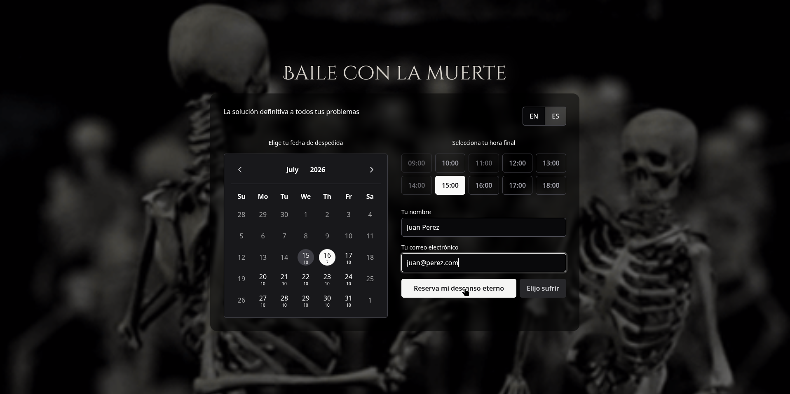

# Danse Macabre

> *"Porque la única manera de estar realmente saludable... es dejar de estar vivo."*

[AgendaSalud.online](https://agendasalud.online/). es la plataforma pionera en el modelo **SaaS** (*Soul as a Service*).

Mientras que los portales médicos tradicionales se desgastan intentando retrasar lo inevitable con tratamientos temporales, nosotros ofrecemos la **optimización definitiva del ciclo de vida del paciente**. Despedirse de las constantes vitales es, técnicamente, erradicar el 100% de las enfermedades conocidas.

Tu consulta automatizada está gestionada directamente por nuestra **Directora de Operaciones Globales**: La Muerte. Tu próxima cita ya está agendada; aquí solo gestionamos el contrato para tu último baile.

Prueba técnica para **JuegaEnLinea**: un sistema de citas médicas que en realidad sirve para reservar tu último baile.


---

## Stack

| Capa | Tecnologia |
|------|-----------|
| Frontend | Nuxt 4.4 SPA (`ssr: false`) + PrimeVue 4.5 (Lara Noir) |
| Backend | Laravel 13 (API REST JSON) |
| Base de datos | PostgreSQL 17 |
| Infra local | Docker Compose (5 servicios) |
| Infra prod | DigitalOcean Droplet + FrankenPHP (Caddy) |

## Arquitectura

```
danse-macabre/
├── backend/                  # Laravel 13 — API REST
│   ├── app/Enums/            # TimeSlot (fuente unica), AppointmentStatus
│   ├── app/Http/Controllers/ # AppointmentController (3 endpoints)
│   ├── app/Services/         # BookAppointmentService (logica de negocio)
│   └── tests/                # 14 tests, 92 assertions
├── frontend/                 # Nuxt 4 SPA
│   ├── app/components/       # Calendar, TimeSlotPicker, BookingForm, Confirmation
│   ├── app/composables/      # useApi (comunicacion con backend)
│   └── app/themes/           # Noir (tema PrimeVue)
├── docker-compose.yml        # Dev: pgsql + backend + frontend + caddy
├── docker-compose.prod.yml   # Prod: database + app (FrankenPHP)
├── Dockerfile.prod           # Multi-stage: Nuxt build → Composer → FrankenPHP
├── .env.example              # Config compartida dev/prod
├── Caddyfile                 # /api/* → PHP, /* → archivos estaticos
└── .github/workflows/ci.yml  # Test en PR, deploy en push a main
```

## Quick Start

```bash
# Clonar
git clone <repo-url> danse-macabre
cd danse-macabre

# Configurar entorno
cp .env.example .env

# Levantar todo (PostgreSQL + API + Frontend)
docker compose up -d

# Correr migraciones
docker compose exec backend php artisan migrate

# Listo
# Frontend: http://localhost:3000
# API:      http://localhost:8000/api
```

## API

3 endpoints, todos bajo `/api`:

| Metodo | Ruta | Descripcion |
|--------|------|-------------|
| `GET` | `/api/slots/{date}` | Slots del dia (disponibles y ocupados) |
| `GET` | `/api/slots/month/{year}/{month}` | Resumen de disponibilidad por mes |
| `POST` | `/api/appointments` | Reservar cita |

### Ejemplo de booking

```json
POST /api/appointments
{
  "name": "Juan Perez",
  "email": "juan@example.com",
  "date": "2025-07-21",
  "time_slot": "10:00"
}
```

Respuesta: `201 Created` con la cita formateada.

## Reglas de negocio

- Solo dias habiles (lunes a viernes)
- Sin fechas pasadas (hoy si cuenta)
- Horario: 09:00 a 18:00 en bloques de 1 hora (10 slots por dia)
- Un mismo bloque (fecha + hora) no se reserva dos veces
- Un correo electronico solo puede tener una cita activa
- La interfaz muestra visualmente que bloques estan disponibles y cuales ocupados

## Desarrollo

### Backend

```bash
# Tests
docker compose exec backend php artisan test

# Formateo de codigo
docker compose exec backend ./vendor/bin/pint

# Migraciones
docker compose exec backend php artisan migrate:fresh --seed
```

### Frontend

```bash
# Dev server (ya levantado con docker compose up)
# Hot reload activo en http://localhost:3000

# Build de produccion
cd frontend && pnpm generate
```

## Produccion

### Stack

Un solo Droplet con Docker. FrankenPHP sirve los archivos estaticos de Nuxt y ejecuta PHP para la API — todo en un solo contenedor.

### Deploy

Al hacer push a `main`, GitHub Actions:
1. Corre los tests contra PostgreSQL
2. Hace SSH al Droplet, baja el codigo, reconstruye containers y corre migraciones

### Setup inicial en el Droplet

```bash
git clone <repo-url> /opt/danse-macabre
cd /opt/danse-macabre
cp .env.example .env
# Editar APP_KEY, APP_DOMAIN, DB_PASSWORD

docker compose -f docker-compose.prod.yml up -d --build
docker compose -f docker-compose.prod.yml exec -T app php artisan key:generate
# Migraciones se ejecutan automaticamente al iniciar el contenedor
```

Requiere GitHub Secrets: `DROPLET_HOST`, `DROPLET_USER`, `DROPLET_SSH_KEY`.

### Dev vs Prod

| Comando | Entorno |
|---------|---------|
| `docker compose up -d` | Desarrollo (5 servicios, hot reload) |
| `docker compose -f docker-compose.prod.yml up -d` | Produccion (FrankenPHP, build optimizado) |

## Spec original

El requisito completo esta en [`docs/PRUEBA_TECNICA.md`](docs/PRUEBA_TECNICA.md).

---

*Desarrollado como prueba tecnica para JuegaEnLinea.*
